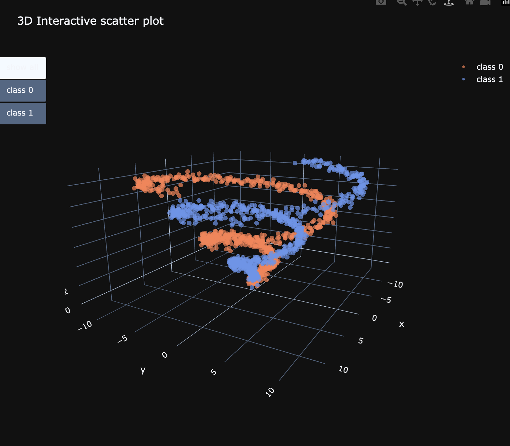
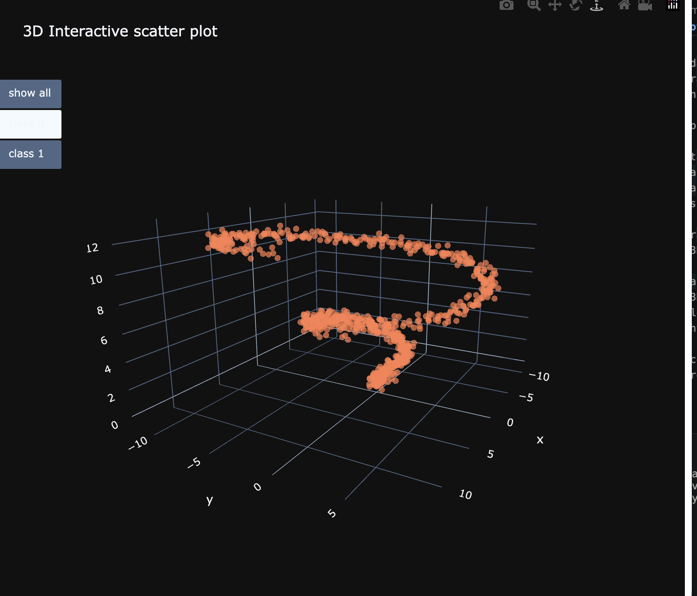
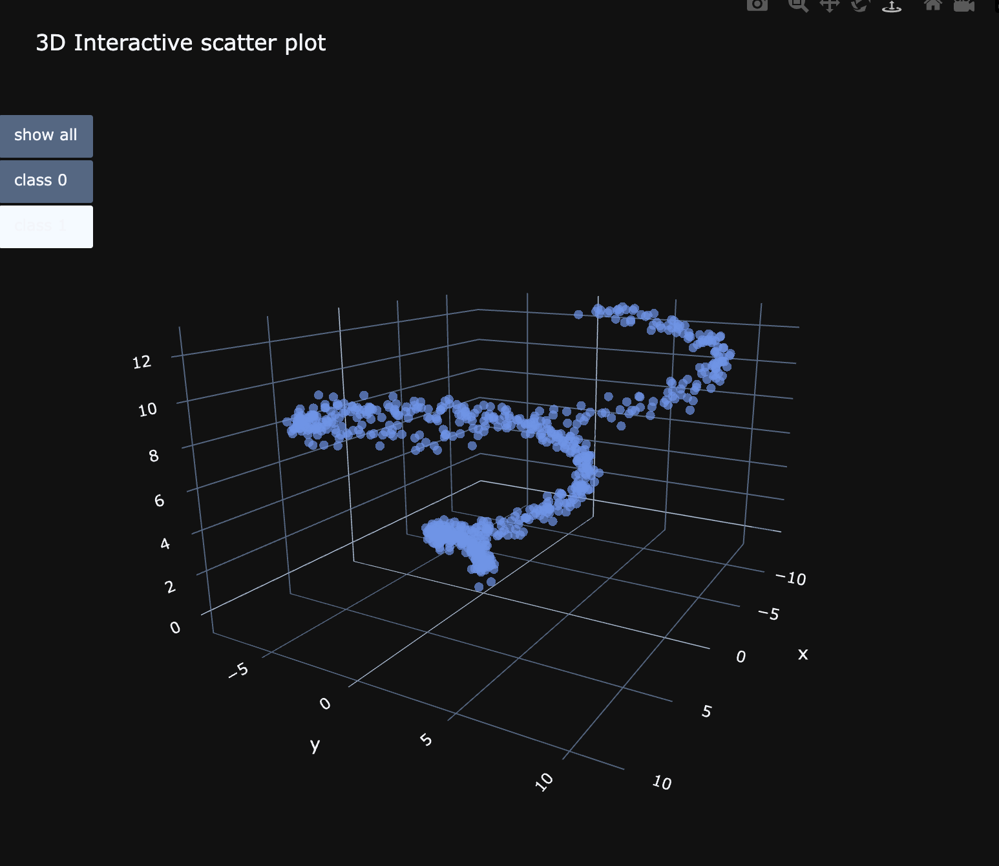
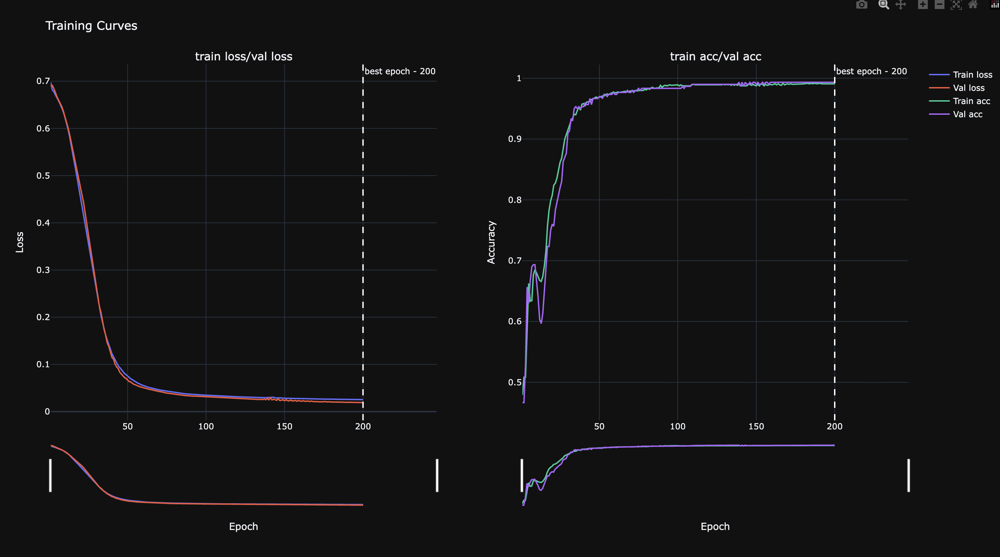
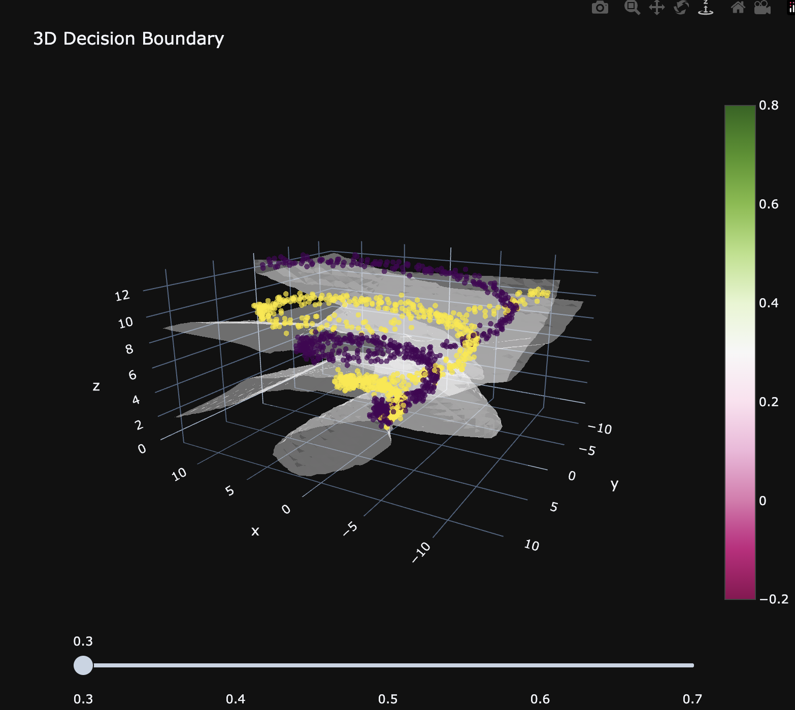
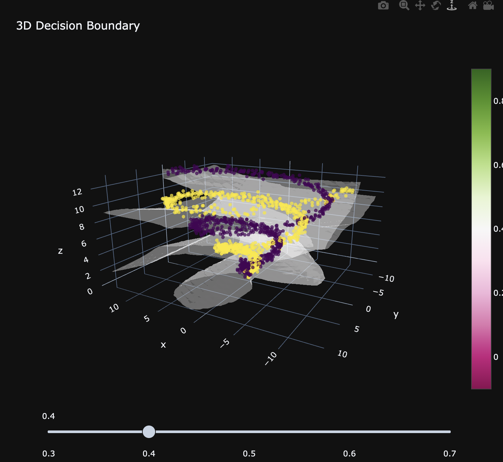
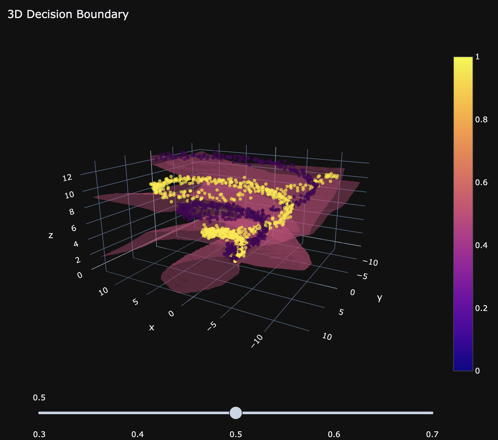
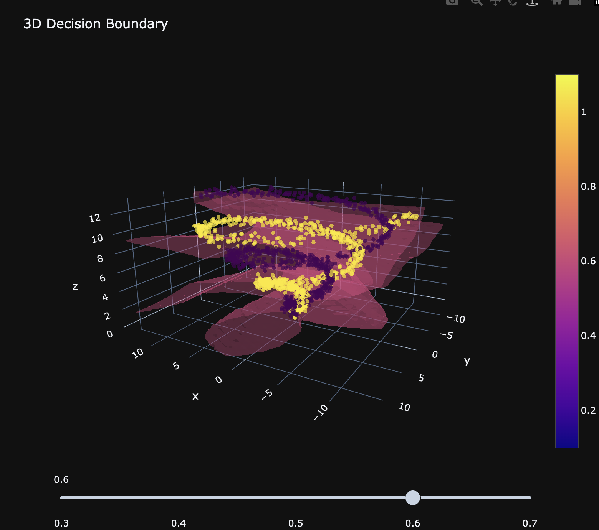
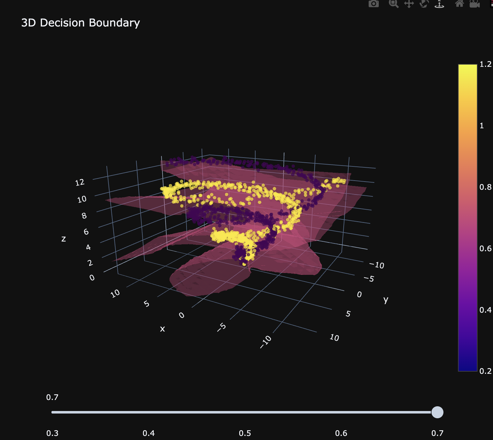

# plotly-nn-explorer-hard

This project implements and analyzes a neural network trained on a synthetic 3D classification dataset.

The dataset consists of two interleaved spirals in 3D space, making it a non-linearly separable problem. This allows evaluation of how well a feedforward neural network can learn complex decision boundaries.

The project includes the full pipeline:

- Dataset generation  
- Training of a neural network using PyTorch  
- Tracking training metrics (loss and accuracy)  
- Visualization of results using Plotly  

Several visualizations are implemented to better understand the model:
- A 3D scatter plot of the dataset, showing how the classes are distributed  

- Training curves, illustrating the learning process over epochs  

- A 3D decision boundary surface, showing how the model separates the two classes

- A loss landscape visualization, showing how the loss changes when modifying model weights  

All components are connected through a single entry point (`main.py`), which runs the entire pipeline and generates all outputs.

